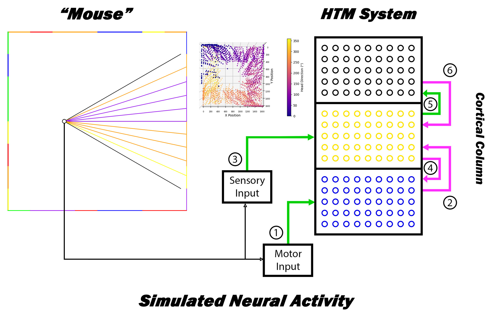

# HTM_MouseSim

## Table of Contents
1. [Overview](#overview) 
2. [Background](#background) 
3. [Algorithm](#algorithm) 
4. [Installation Requirements](#installation-requirements) 
5. [Usage](#usage) 

## Overview 
HTM_MouseSim is a simulation project that models the neural activity of the mammalian brain while navigating an environment. The project is based on the Hierarchical Temporal Memory (HTM) architecture developed by Numenta.

## Background 
Mammals, such as rats, exhibit fascinating neural firing patterns while navigating their environments. Some neurons fire based on specific locations (i.e., [place cells](https://en.wikipedia.org/wiki/Place_cell)), head orientations (i.e., [head-direction cells](https://en.wikipedia.org/wiki/Head_direction_cell)), environment boundaries (i.e., [boundary cells](https://en.wikipedia.org/wiki/Boundary_cell)), grid-like patterns (i.e., [grid cells](https://en.wikipedia.org/wiki/Grid_cell)). HTM_MouseSim aims to reproduce these neural activities by implementing a mobile agent (a mouse) with a simulated "brain" based on the HTM architecture. HTM is a neuroscientific theory suggesting that the navigation and conscious regions of the brain consist of layered columns. Neurons in different layers interconnect and interpret various subsets of input, such as motor and sensory input. Other layers within the same column are thought to compile sensory and motor activity into concrete representations, called objects. 

### Valuable Video Resources
- [HTM Theory - Summarized by Jeff Hawkins](https://www.youtube.com/watch?v=VqDVUWgJQPI)
- [How Your Brain Organizes Information - Neurosummary by Artem Kirsanov](https://www.youtube.com/watch?v=9qOaII_PzGY&t=1378s)
- [HTM School - Playlist by Matt Taylor dealing with the architecture of HTM](https://www.youtube.com/playlist?list=PL3yXMgtrZmDqhsFQzwUC9V8MeeVOQ7eZ9)

## Algorithm 
The simulated agent moves in randomly generated directions and perceives its environment through rays cast from its eye. The agent's brain processes the sensorimotor input at regular intervals, encoding and interpreting it across separate cortical column layers. The sensory and motor layers' activity is then compiled in a third object layer. To train the neural network, a predefined number of movement iterations and regular thought intervals are used for processing the input. Neural activity is refined over time based on current activity and predicted activity from previous and subsequent time steps. If the predicted activity aligns with the current activity, connections between active neurons in previous and current time steps are reinforced. Inactive neurons or neurons incorrectly predicting activity are weakened. As a result, networks of neurons in sensory or motor layers represent possible input sequences over time. The object layer should eventually represent a set of compiled sensorimotor sequences derived from object exploration. 

## Installation Requirements
- Python 3.10 (at the time of implementation; 3.11 should also work) 
- [Htm.core library](https://github.com/htm-community/htm.core) 
- Install all Python libraries included in `requirements.txt` 

## Usage 
`main.py` maintains the relationship between the environment (here: `Box`) and the mobile agent (here: `Animal`). In `main.py`, you define the length of the simulation, the amount of time for recording neural activity, the size of the environment, and the functional aspects of the agent. The HTM network is defined in the `Brain` and `CorticalColumn` classes. The `Brain` class organizes and manages inputs and cortical columns, while the `CorticalColumn` class defines the parameters of the columns, the nature of encoding inputs, and how information flows within the column.

Neural activity is recorded by the brain and output to a csv. At the end of a simulation, the neural activity is plotted and the plots are saved in output folder. All cell activity is recorded via the `cell_activity_to_csv.py` script, then split into individual column layers via `print_cells_csv.py`, and figures are created and saved via `save_3d_scatters.py`.